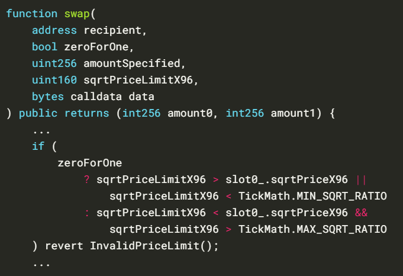

# 2024-Spring-HW2

Please complete the report problem below:

## Problem 1
Provide your profitable path, the amountIn, amountOut value for each swap, and your final reward (your tokenB balance).

tokenB -> tokenA
amountIn: 5
amountOut 5.655321988655322

tokenA -> tokenC
amountIn: 5.655321988655322
amountOut 2.372138936383089

tokenC -> tokenE
amountIn: 2.372138936383089
amountOut 1.5301371369636168

tokenE -> tokenD
amountIn: 1.5301371369636168
amountOut 3.450741448619708

tokenD -> tokenC
amountIn: 3.450741448619708
amountOut 6.684525579572586

tokenC -> tokenB
amountIn: 6.684525579572586
amountOut 22.49722180697414

path: tokenB->tokenA->tokenC->tokenE->tokenD->tokenC->tokenB, tokenB balance=22.49722180697414

## Problem 2
What is slippage in AMM, and how does Uniswap V2 address this issue? Please illustrate with a function as an example.

滑點(Slippage)指的是進行交易前的期望價格與交易實際執行價格之間的價差，造成價差的原因主要在於發送交易和交易被打包進區塊鏈之間有時間上的延遲，在此期間市場快速變動，造成交易價格比預期高或低。

為了避免交易受到滑點的影響過大，可以在合約的swap中多加一個設定交易停機價格的參數，若交易時價格波動大於該設定的參數就終止交易。以下列程式為例，其中sqrtPriceLimitX96為設定交易停機價格的參數:

程式碼來源: https://y1cunhui.github.io/uniswapV3-book-zh-cn/docs/milestone_3/slippage-protection/?fbclid=IwAR0g7Sw0jJCBN9hnqKt-jvSCLzvY1dHv1F-kkgeZykO6SON_gO4Y1b9BWP8_aem_AbTHagpA1SY-0c-YqVIjOMuAQf0BowFa6m48u_sJJGYXL66UGxsNKfAMLjpEkZ-vC22BYlse4OB1KycoOjvIzqir

## Problem 3
Please examine the mint function in the UniswapV2Pair contract. Upon initial liquidity minting, a minimum liquidity is subtracted. What is the rationale behind this design?

minimum liquidity會被永久鎖定，這樣可以確保流動池中始終有tokens存在，不會因為tokens被提取完而使流動池失去功能。

## Problem 4
Investigate the minting function in the UniswapV2Pair contract. When depositing tokens (not for the first time), liquidity can only be obtained using a specific formula. What is the intention behind this?

liquidity = min(amount0/reserve0, amount1/reserve0) * totalSupply
如果tokens以不同的比例被加進流動池，liquidity將會變得難以計算，為了解決這個問題，當提供比例與池中不同的tokens時，會拿到較低的liquidity作為處罰，這樣對平台來說沒有損失，提供者也會為了避免損失而提供與池中比例相同的tokens。

## Problem 5
What is a sandwich attack, and how might it impact you when initiating a swap?

三明治攻擊：攻擊者發現有利可圖的交易後，在該筆交易前後搶先安插其他交易，從交易的價差中賺取利潤。例如在你要買進之前先買進，價格拉高後倒賣給你；或反過來在你賣出之前先賣出，價格壓低之後再跟你買回。三明治攻擊會使你在發起交易後最終的成交價格比預期中差，造成價差上的損失。

